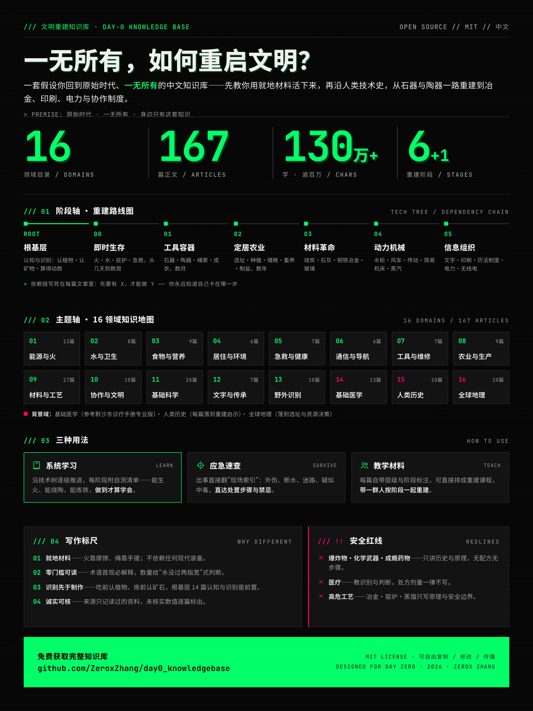

# 文明重建知识库

**Day 0——你一无所有的那一天，从这本书开始。**

> 设想这样一个早晨：你睁开眼，身处荒野。没有手机，没有超市，没有医院，没有火，甚至没有一只杯子。你拥有的一切，只有手边这一套知识。
>
> 接下来的 24 小时，决定你能否活过第一夜；接下来的一年，决定你能否吃上自己种出的粮食；接下来的十年，决定你能否重新拥有金属、文字，和一座像样的村庄。



---

## 这是什么

一份中文 Markdown 知识库，假设条件只有一句话：

> **使用者回到原始时代，一无所有，身边只有这份知识库。**

它回答两个问题：

1. **怎么活下来**——用就地可得的材料，重建火、水、食物、住所、健康这些生存底线；
2. **怎么重建文明**——沿人类技术史的主干，从石器、陶器、农业，一路走到冶金、动力机械、印刷、电力与组织制度，最终恢复文明的生产力与协作体系。

目前的规模：**16 个领域目录、174 篇正文、逾百万字**。每篇文章按统一模板写成——可读、可查、可教，也可持续扩展。

## 它与一般"生存手册"的区别

市面上的生存指南大多默认你还有一把瑞士军刀、一个打火机、一瓶碘伏。这份知识库的写作标尺更苛刻，也因此更彻底：

- **一切从就地材料开始。** 火靠摩擦，容器靠陶土，绳索靠手搓纤维，药靠辨认植物。每篇从零重建文章都有"从零实现路径"一节，写清依赖链——先要有 X，才能做 Y，你永远知道自己卡在哪一步。
- **不预设读者见过现代世界。** 每个术语第一次出现都有一句话解释；每个操作分解到"手怎么放、力怎么使、看到什么现象算成功"；数量给出可复制的判断方法（"水没过材料两指宽"）。宁可啰嗦，不可跳步。
- **识别先于制作。** 吃之前要会认植物，打石器之前要会认石料，冶金之前要会认矿石。根基层的 14 篇认知与识别文章（物质与元素、数与算术、野外识别十篇、天气、地质），是全部技术文章的前置阅读。
- **学到手 = 能做到，不是读过。** 每个重建阶段附有一份自测清单：能在一小时内生起并护住一堆火、能烧出一只不渗水的陶碗、能炼出铜或铁——勾不上，就是还没学会。

## 知识体系：两条轴

**阶段轴**——重建的推进顺序，也是技术之间的依赖顺序：

| 阶段 | 主题 | 学成后你能做什么 |
| --- | --- | --- |
| 根基层 | 认知与识别 | 认出身边的物质、动植物、岩石与矿物，算得动数 |
| 0 即时生存 | 头几天～数周 | 生火、找水净水、搭过夜庇护、辨认可食、处理外伤 |
| 1 工具与容器 | 数月 | 石刀石斧、绳索、陶器、皮衣皮鞋、织带 |
| 2 定居与农业 | 数年 | 选址、种植驯化、灌溉储粮、畜养、制盐 |
| 3 材料革命 | 数年～数十年 | 烧炭窑、石灰砂浆、炼铜炼铁、玻璃、肥皂 |
| 4 动力与机械 | — | 水轮风车、传动机构、简易机床、蒸汽 |
| 5 信息与组织 | — | 文字纸张、印刷、历法与度量衡、治理与公共卫生、电力与无线电 |

**主题轴**——16 个领域目录，大致按技术栈的先后排列：

| # | 领域 | 篇数 | 覆盖 |
| --- | --- | --- | --- |
| 01 | 能源与火 | 13 | 摩擦取火 → 生物质燃料与照明 → 水轮风车 → 蒸汽 → 从零电力 |
| 02 | 水与卫生 | 8 | 无装备找水净水 → 陶器容器 → 打井供水 → 蒸馏 → 给排水工程 |
| 03 | 食物与营养 | 9 | 采集渔猎 → 盐糖油脂获取 → 保存 → 储粮窖藏 → 农业 |
| 04 | 居住与环境 | 6 | 原始避难 → 土坯夯土 → 窑炉热工 → 永久建筑 |
| 05 | 急救与健康 | 7 | 原始条件救治 → 卫生与草药（标注证据边界）→ 公共卫生与助产 |
| 06 | 通信与导航 | 6 | 原始定向与信号 → 光声信号系统 → 电报 → 无线电 |
| 07 | 工具与维修 | 7 | 石器打制 → 骨木工具 → 简单机械 → 金属工具 → 简易机床 |
| 08 | 农业与生产 | 9 | 从采集到驯化 → 育种 → 农具役畜 → 灌溉工程 → 轮作体系 |
| 09 | 材料与工艺 | 17 | 陶器 → 皮革 → 纺织 → 木炭 → 石灰砂浆 → 铜铁冶金 → 玻璃 → 制皂 |
| 10 | 协作与文明 | 10 | 群体组织 → 分工 → 历法度量衡 → 贸易货币 → 法律治理 → 防御 |
| 11 | 基础科学 | 32 | 数理 → 物理 → 化学 → 生命 → 地球宇宙 → 科学方法 → 大学数学（微积分/线性代数/数论等） |
| 12 | 文字与知识传承 | 7 | 文字 → 纸墨 → 印刷 → 教育 → 图书馆与记录 |
| 13 | 野外识别 | 10 | 识别方法论 → 植物（可食/剧毒/蘑菇）→ 动物追踪 → 岩石矿物 → 土壤 → 木材纤维 |
| 14 | 基础医学 | 13 | 人体生理 → 症状评估 → 感染病与各系统常见病 → 无医条件照护 |
| 15 | 人类历史 | 10 | 起源 → 农业革命 → 文明演进 → 工业革命 → 崩溃与复原规律 |
| 16 | 全球地理 | 10 | 气候带 → 大洲档案 → 资源分布 → 自制地图 → 选址踏勘 |

其中 14～16 是三个**背景域**：基础医学重点参考《默沙东诊疗手册》专业版（只讲识别判断，不写处方剂量）；人类历史每篇落到"对重建者的启示"；全球地理落到选址与资源决策。

**三层视角**：每篇文章都标注了自己的视角——

- **从零重建**（本库核心视角）：一无所有时怎么做；
- **应急**：现代环境中突发中断、还有部分残留物资可用时怎么做；
- **通用**：科学原理与计量方法。

## 一篇文章长什么样

全库文章共用一个模板，结构固定，是为了让你在任何一篇文章里都能快速找到需要的东西：

```text
# 主题名称
层级（基础/进阶）· 视角 · 阶段（0～5）· 状态（已核对/待核验）

## 解决什么问题        ← 这篇文章为什么值得读
## 核心知识与原理      ← 底层机制
## 从零实现路径        ← 一无所有时怎么做，写清依赖链
## 方法与应用          ← 有残留物资/现代条件时的做法
## 常见错误与限制      ← 别人栽过的跟头
## 延伸与关联          ← 上下游文章链接
## 来源与待核验项      ← 引用了什么、哪些数值还没核实
```

两个设计值得强调：

- **依赖链写在明面上。** "先要有 X，才能做 Y"——你不会在缺窑的时候读到烧瓷，也不会在没学会认矿石时被要求炼铁。
- **诚实标注核实状态。** 来源只记录实际读过的资料；未核实的数值列入每篇"待核验项"。凡涉及医疗、化学品、用电、高温工艺，动手前先核对该篇待核验项，未核对项按保守方向执行。

## 三种用法

1. **系统学习**：从 [00_roadmap.md](00_roadmap.md) 的技术树出发，确定自己所处的重建阶段，从根基层读到阶段 0 再逐级向上；每个节点先读"从零实现路径"确认依赖，再读全文。每季对照 [00_使用指南.md](00_使用指南.md) 的自测清单勾一次，空缺项就是下一季的目标。
2. **应急速查**：出事时不需要通读，直接用 [00_使用指南.md](00_使用指南.md) 第四节的"现场索引"——有人倒下翻急救、断水翻净水、迷路翻定向、疑似误食翻剧毒识别——跳到对应文章的"方法与应用"节，"常见错误与限制"是必读项。
3. **教学材料**：每篇文章的层级、视角、阶段标注可以直接当课程大纲用（配套见 [教育体系](12_knowledge/05_education_system.md)）。要教一群人重建，照着阶段轴排课即可。

## 内容边界与诚实声明

这份知识库有几条不可退让的边界，也是对读者的承诺：

- **安全红线**：爆炸物、化学武器、成瘾性药物只做历史脉络与作用原理的介绍，不提供配方与制作步骤；医疗内容不写处方剂量；冶金、窑炉、蒸馏等高危工艺写原理与安全边界，反复强调烟气、烫伤与一氧化碳风险。
- **不编造引用**：来源只记录实际读到的资料，未核实的内容明确标记，绝不伪装成定论。
- **知识不等于能力**：这本书能告诉你每一步怎么做、错在哪，但纸上得来终觉浅——真实环境里的判断永远优先于书中条文，动手前的核对与练习无法被阅读替代。

## 快速入口

| 你是…… | 从这里进 |
| --- | --- |
| 第一次来，想了解全貌 | [00_roadmap.md](00_roadmap.md)（技术树与依赖链）→ [00_使用指南.md](00_使用指南.md)（读法与自测） |
| 想按领域浏览或查某篇文章 | [INDEX.md](INDEX.md)（总目录） |
| 出事了，要立刻查 | [00_使用指南.md](00_使用指南.md) 第四节"应急速查索引" |
| 想知道学到什么程度算过关 | [00_使用指南.md](00_使用指南.md) 第三节"阶段达标自测清单" |
| 想了解这套知识的历史逻辑 | [15_history](15_history/README.md)（每篇落到"对重建者的启示"） |

## 许可

本项目以 [MIT License](LICENSE) 开源——欢迎使用、复制、修改与传播，唯请保留许可声明与来源标注。
