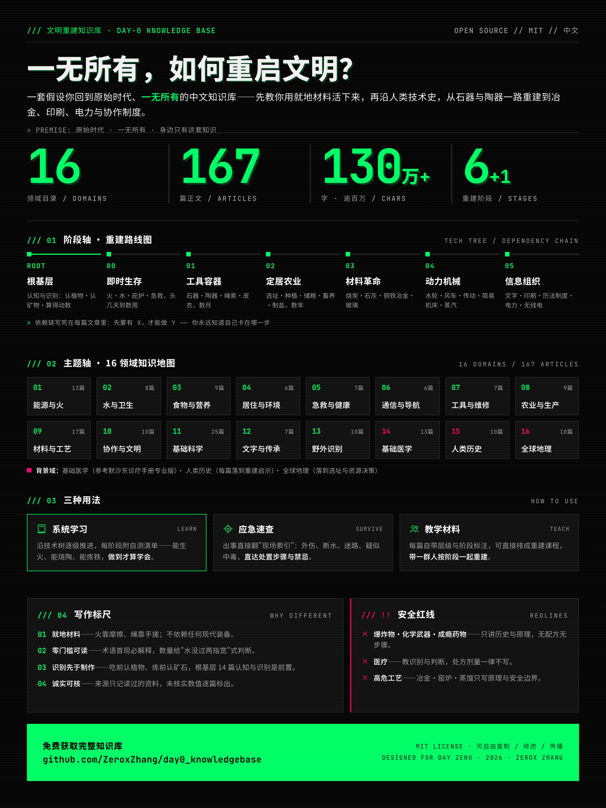

# 文明重建知识库

**Day 0——你一无所有的那一天，从这本书开始。**

> 设想这样一个早晨：你睁开眼，身处荒野。没有手机，没有超市，没有医院，没有火，甚至没有一只杯子。你拥有的一切，只有手边这一套知识。
>
> 接下来的 24 小时，决定你能否活过第一夜；接下来的一年，决定你能否吃上自己种出的粮食；接下来的十年，决定你能否重新拥有金属、文字，和一座像样的村庄。



---

## 这是什么

一份中文 Markdown 知识库，假设条件只有一句话：

> **使用者回到原始时代，一无所有，身边只有这份知识库。**

它回答两个问题：

1. **怎么活下来**——用就地可得的材料，重建火、水、食物、住所、健康这些生存底线；
2. **怎么重建文明**——沿人类技术史的主干，从石器、陶器、农业，一路走到冶金、动力机械、印刷、电力与组织制度，最终恢复文明的生产力与协作体系。

目前的规模：**6 大部、19 个领域、238 篇正文、超过 340 万字**，按"部 → 领域 → 篇"两级主题结构组织。每篇文章按统一模板写成——可读、可查、可教，也可持续扩展。2026-09 完成"文明百科深化战役"（技术域 110 篇全部深化至百科深度）与"现代科学与现代社会域拓展战役"：新增 **17 计算与信息**（从零重建计算能力阶梯：算具、二进制、逻辑门、机械与继电器计算机、算法、软件、信息论）、**18 心理与行为**（个体—群体—重建社会心理支持体系）、**19 经济与金融**（经济学原理 × 金融货币史 × 重建经济体制度设计）三个现代域共 33 篇；11_science 扩至 42 篇（新增数理逻辑、微分方程、数值方法、原子与放射性、固体与半导体、相对论与量子、化学键、电化学、化学分析、生物化学）；14_medicine 扩至 21 篇并完成 9 篇存量深化（新增营养缺乏病、寄生虫病、免疫与疫苗、抗感染药物、从零检验诊断、麻醉与疼痛管理）。2026-09-28 完成结构重组（EXECUTION_GUIDE v3.0）：19 个领域目录按六部归组，域目录名与域内编号保持不变。

## 它与一般"生存手册"的区别

市面上的生存指南大多默认你还有一把瑞士军刀、一个打火机、一瓶碘伏。这份知识库的写作标尺更苛刻，也因此更彻底：

- **一切从就地材料开始。** 火靠摩擦，容器靠陶土，绳索靠手搓纤维，药靠辨认植物。每篇从零重建文章都有"从零实现路径"一节，写清依赖链——先要有 X，才能做 Y，你永远知道自己卡在哪一步。
- **不预设读者见过现代世界。** 每个术语第一次出现都有一句话解释；每个操作分解到"手怎么放、力怎么使、看到什么现象算成功"；数量给出可复制的判断方法（"水没过材料两指宽"）。宁可啰嗦，不可跳步。
- **识别先于制作。** 吃之前要会认植物，打石器之前要会认石料，冶金之前要会认矿石。根基层的 14 篇认知与识别文章（物质与元素、数与算术、野外识别十篇、天气、地质），是全部技术文章的前置阅读。
- **学到手 = 能做到，不是读过。** 每个重建阶段附有一份自测清单：能在一小时内生起并护住一堆火、能烧出一只不渗水的陶碗、能炼出铜或铁——勾不上，就是还没学会。

## 知识体系：两条轴

**阶段轴**——重建的推进顺序，也是技术之间的依赖顺序：

| 阶段 | 主题 | 学成后你能做什么 |
| --- | --- | --- |
| 根基层 | 认知与识别 | 认出身边的物质、动植物、岩石与矿物，算得动数 |
| 0 即时生存 | 头几天～数周 | 生火、找水净水、搭过夜庇护、辨认可食、处理外伤 |
| 1 工具与容器 | 数月 | 石刀石斧、绳索、陶器、皮衣皮鞋、织带 |
| 2 定居与农业 | 数年 | 选址、种植驯化、灌溉储粮、畜养、制盐 |
| 3 材料革命 | 数年～数十年 | 烧炭窑、石灰砂浆、炼铜炼铁、玻璃、肥皂 |
| 4 动力与机械 | — | 水轮风车、传动机构、简易机床、蒸汽 |
| 5 信息与组织 | — | 文字纸张、印刷、历法与度量衡、治理与公共卫生、电力与无线电 |

**主题轴**——六部 × 19 领域的两级结构，部按"认知 → 生存 → 生产 → 组织 → 背景 → 现代"的依赖与重建顺序排列，每部入口 README 给出域清单、阅读顺序与跨部关系：

| 部 | 含域（篇数） | 定位 |
| --- | --- | --- |
| [01 根基层](01_根基层/README.md) | 11 基础科学（42）· 13 野外识别（10） | 认知与识别：全库地基——认得出、算得动 |
| [02 生存域](02_生存域/README.md) | 01 能源与火（15）· 02 水与卫生（8）· 03 食物与营养（10）· 04 居住与环境（6）· 05 急救与健康（7） | 火·水·食物·住所·急救：人与聚落的生存底线 |
| [03 生产与技术](03_生产与技术/README.md) | 06 通信与导航（6）· 07 工具与维修（10）· 08 农业与生产（9）· 09 材料与工艺（19） | 从石器到机床、农业到材料、信号到无线电 |
| [04 组织与文明](04_组织与文明/README.md) | 10 协作与文明（13）· 12 文字与知识传承（7） | 制度与记录：突破邓巴数的两件武器 |
| [05 背景域](05_背景域/README.md) | 14 基础医学（21）· 15 人类历史（12）· 16 全球地理（10） | 服务全部阶段的判断依据、先后之鉴与空间决策 |
| [06 现代域](06_现代域/README.md) | 17 计算与信息（11）· 18 心理与行为（10）· 19 经济与金融（12） | 计算阶梯 · 心理照护 · 经济体制度设计 |

其中 05 背景域的基础医学重点参考《默沙东诊疗手册》专业版（只讲识别判断，不写处方剂量）；06 现代域三域的落点同样是重建：计算讲"算与记"的能力阶梯，心理讲崩溃与重建环境下的照护与士气，经济讲货币重启、市场秩序与制度最小集；各域收官综述给出从零装配表。逐域覆盖明细见 [INDEX.md](INDEX.md) 总目录。

**三层视角**：每篇文章都标注了自己的视角——

- **从零重建**（本库核心视角）：一无所有时怎么做；
- **应急**：现代环境中突发中断、还有部分残留物资可用时怎么做；
- **通用**：科学原理与计量方法。

## 一篇文章长什么样

全库文章共用一个模板，结构固定，是为了让你在任何一篇文章里都能快速找到需要的东西：

```text
# 主题名称
层级（基础/进阶）· 视角 · 阶段（0～5）· 状态（已核对/待核验）

## 解决什么问题        ← 这篇文章为什么值得读
## 核心知识与原理      ← 底层机制
## 从零实现路径        ← 一无所有时怎么做，写清依赖链
## 方法与应用          ← 有残留物资/现代条件时的做法
## 常见错误与限制      ← 别人栽过的跟头
## 延伸与关联          ← 上下游文章链接
## 来源与待核验项      ← 引用了什么、哪些数值还没核实
```

两个设计值得强调：

- **依赖链写在明面上。** "先要有 X，才能做 Y"——你不会在缺窑的时候读到烧瓷，也不会在没学会认矿石时被要求炼铁。
- **诚实标注核实状态。** 来源只记录实际读过的资料；未核实的数值列入每篇"待核验项"。凡涉及医疗、化学品、用电、高温工艺，动手前先核对该篇待核验项，未核对项按保守方向执行。

## 四种用法

1. **系统学习**：从 [00_roadmap.md](00_roadmap.md) 的技术树出发，确定自己所处的重建阶段，从根基层读到阶段 0 再逐级向上；每个节点先读"从零实现路径"确认依赖，再读全文。每季对照 [00_使用指南.md](00_使用指南.md) 的自测清单勾一次，空缺项就是下一季的目标。
2. **应急速查**：出事时不需要通读，直接用 [00_使用指南.md](00_使用指南.md) 第四节的"现场索引"——有人倒下翻急救、断水翻净水、迷路翻定向、疑似误食翻剧毒识别——跳到对应文章的"方法与应用"节，"常见错误与限制"是必读项。
3. **教学材料**：每篇文章的层级、视角、阶段标注可以直接当课程大纲用（配套见 [教育体系](04_组织与文明/12_knowledge/05_education_system.md)）。要教一群人重建，照着阶段轴排课即可。
4. **百科研读**：把全库当一部人类文明百科通读——[00_使用指南.md](00_使用指南.md) 第六节提供十一条专题书单（动力线、材料线、组织线、知识线、医疗线、运输线、仪器线、饮食线、计算线、心智线、经济线），每条线读通"人类文明是怎么搭起来的，以及为什么这样搭"。

## 内容边界与诚实声明

这份知识库有几条不可退让的边界，也是对读者的承诺：

- **安全红线**：爆炸物、化学武器、成瘾性药物只做历史脉络与作用原理的介绍，不提供配方与制作步骤；医疗内容不写处方剂量；冶金、窑炉、蒸馏等高危工艺写原理与安全边界，反复强调烟气、烫伤与一氧化碳风险。
- **不编造引用**：来源只记录实际读到的资料，未核实的内容明确标记，绝不伪装成定论。
- **知识不等于能力**：这本书能告诉你每一步怎么做、错在哪，但纸上得来终觉浅——真实环境里的判断永远优先于书中条文，动手前的核对与练习无法被阅读替代。

## 快速入口

| 你是…… | 从这里进 |
| --- | --- |
| 第一次来，想了解全貌 | [00_roadmap.md](00_roadmap.md)（技术树与依赖链）→ [00_使用指南.md](00_使用指南.md)（读法与自测） |
| 想按领域浏览或查某篇文章 | [INDEX.md](INDEX.md)（总目录） |
| 出事了，要立刻查 | [00_使用指南.md](00_使用指南.md) 第四节"应急速查索引" |
| 想知道学到什么程度算过关 | [00_使用指南.md](00_使用指南.md) 第三节"阶段达标自测清单" |
| 想了解这套知识的历史逻辑 | [15_history](05_背景域/15_history/README.md)（每篇落到"对重建者的启示"） |

## 许可

本项目以 [MIT License](LICENSE) 开源——欢迎使用、复制、修改与传播，唯请保留许可声明与来源标注。
